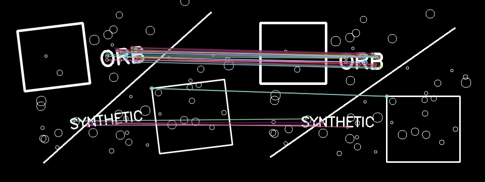

# beverage-vision-matcher

A small classical computer-vision experiment that compares a query photograph of
a beverage product against known reference images. It explores how local feature
matching behaves under viewpoint changes, low light, occlusion, and glare; it is
not a production product-recognition system.

## Approach

```text
Query image → ORB features → Hamming KNN matches → ratio filtering
            → RANSAC homography → geometric inliers → score/rank → product or UNKNOWN
```

ORB provides binary local descriptors, so OpenCV's Hamming-distance BFMatcher is
a natural baseline. The ratio test discards ambiguous nearest-neighbour matches.
RANSAC then rejects correspondences that do not support a shared geometric
transform. The score is `inlier_count * inlier_ratio`, and a product is accepted
only with at least 8 RANSAC inliers and a 0.30 inlier ratio.

## Example match



This synthetic example shows ORB correspondences that remain after descriptor
filtering and RANSAC geometric verification. It is a synthetic demonstration,
separate from the real beverage evaluation dataset whose raw photographs are not
published.

## Usage

```bash
python -m pip install -e . -r requirements.txt
python scripts/match.py --references data/references --query path/to/query.jpg
python scripts/evaluate.py --references data/references --queries data/queries --output results/evaluation.csv
```

Add `--visualize` to `match.py` to save verified feature correspondences under
`results/`. The references follow `data/references/<product>/`, and queries use
`data/queries/<product>/<product>__<condition>.jpg`.

## Baseline experiment

Using the unchanged baseline thresholds, the matcher correctly identified 11 of
15 known-product queries (73.3%) in a small locally collected experiment with
three products (`goodbuzz`, `mo`, and `redbull`), one reference image per product,
and five queries per product. Normal, angle, and low-light conditions each had
3/3 correct queries; glare and occlusion each had 1/3 correct.

The raw beverage photographs are intentionally local and gitignored. The committed
[`results/evaluation.csv`](results/evaluation.csv) contains derived measurements
only. This small, curated dataset is not evidence of general product-recognition
accuracy, and the baseline thresholds were not tuned on it.

## Limitations and future work

A single planar homography only approximates curved cans and bottles. Packaging
glare, strong occlusion, viewpoint change, low texture, and visually similar
designs can reduce reliable correspondences. Future work could evaluate multiple
references per product, compare SIFT, use a separate calibration/test split, and
collect a larger independent dataset. Feature detection, correspondence, and
geometric consistency also connect to multi-view geometry such as structure from
motion; this project does not implement SfM or 3D reconstruction.
